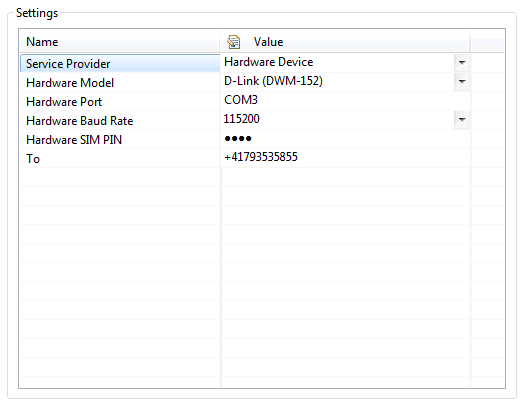
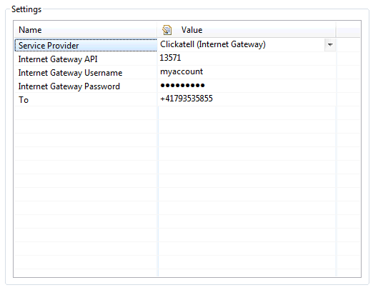
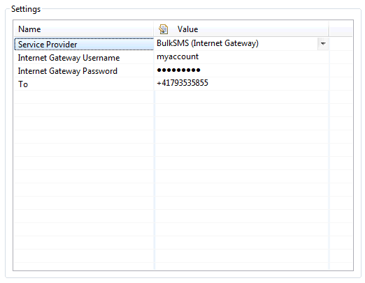
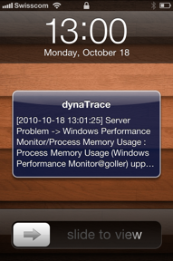

<html xmlns="http://www.w3.org/1999/xhtml">
<head>
    <title>SMS Notification Plugin</title>
    <meta http-equiv="Content-Type" content="text/html; charset=UTF-8"/>
    <meta http-equiv="X-UA-Compatible" content="IE=EmulateIE8" />
    <meta content="Scroll Wiki Publisher" name="generator"/>
    <link type="text/css" rel="stylesheet" href="css/blueprint/liquid.css" media="screen, projection"/>
    <link type="text/css" rel="stylesheet" href="css/blueprint/print.css" media="print"/>
    <link type="text/css" rel="stylesheet" href="css/content-style.css" media="screen, projection, print"/>
    <link type="text/css" rel="stylesheet" href="css/screen.css" media="screen, projection"/>
    <link type="text/css" rel="stylesheet" href="css/print.css" media="print"/>
</head>
<body>
                <h1>SMS Notification Plugin</h1>
    

        <h2>Overview</h2>
    

            
            

    

The dynaTrace SMS Notification Plugin enables dynaTrace to send notifications, such as alerts of incidents, via SMS to cell phones.The plugin is based on the open source project <a href="http://smslib.org/">SMSLib</a>, wich provides a flexible communication API, good support for hardware devices and also support for internet SMS gateway services.    

    

The following outbound technologies are supported:    

<ul class=" "><li class=" ">    

Hardware Devices (USB, Serial Port, Bluetooth. See L<a href="http://smslib.org/doc/compatibility/">ist of Known Compatible Devices</a>)    

</li><li class=" ">    

<a href="http://www.clickatell.com">Clickatell</a>, Internet Gatway    

</li><li class=" ">    

<a href="http://www.bulksms.com">BulkSMS</a>, Internet Gateway    

</li></ul>    

    

        <h2>Plugin Details</h2>
    

        <table>
<thead class=" "></thead><tfoot class=" "></tfoot><tbody class=" ">    <tr>
            <td rowspan="1" colspan="1">
        

Author    

            </td>
                <td rowspan="1" colspan="1">
        

Christian Grimm (christian.grimm@dynatrace.com)    

            </td>
        </tr>
    <tr>
            <td rowspan="1" colspan="1">
        

dynaTrace Versions    

            </td>
                <td rowspan="1" colspan="1">
        

dynaTrace 3.5    

            </td>
        </tr>
    <tr>
            <td rowspan="1" colspan="1">
        

License    

            </td>
                <td rowspan="1" colspan="1">
        

<a href="attachments_5275722_2_dynaTraceBSD.txt">dynaTrace BSD</a>    

            </td>
        </tr>
    <tr>
            <td rowspan="1" colspan="1">
        

Support    

            </td>
                <td rowspan="1" colspan="1">
        

<a href="https://community/display/DL/Support+Levels">Not Supported</a>    

            </td>
        </tr>
    <tr>
            <td rowspan="1" colspan="1">
        

Known Problems    

            </td>
                <td rowspan="1" colspan="1">
        

    

            </td>
        </tr>
    <tr>
            <td rowspan="1" colspan="1">
        

Release History    

            </td>
                <td rowspan="1" colspan="1">
        

2011-03-10 Initial Release    

            </td>
        </tr>
    <tr>
            <td rowspan="1" colspan="1">
        

Download    

            </td>
                <td rowspan="1" colspan="1">
        

<a href="https://community.compuwareapm.com/community/download/attachments/45777033/com.dynatrace.diagnostics.plugins.SMSNotification_0.8.5.jar?api=v2">dynaTrace SMS Notification Plugin 0.8.5</a>    

            </td>
        </tr>
</tbody>        </table>
            

    

    

        <h2>Installation</h2>
    

Import the Plugin into the dynaTrace Server. For details how to do this please refer to the <a href="SMS_Notification_Plugin.html">Online Documentation on Plugin Management</a>.    

    

    

        <h2>Configuration</h2>
    

The action plugin can be configured with three different setups:    

    

        <h3>Hardware Device</h3>
    

The following screenshot shows an example configuration for the D-Link DWM-152 USB modem.    

    

            
            

    

    
<strong class=" ">Cickatell (Internet Gateway)</strong>    
    

    

Sample <a href="http://www.clickatell.com">Clickatell</a> configuration:    

    

            
         Please note that an API has to be created within the Clickatell administration web console.    

    

    

        <h3>BulkSMS (Internet Gateway)</h3>
    

This shows an example of how the SMS Plugin can be configured to use the <a href="http://www.bulksms.com">BulkSMS</a> internet gateway:    

    

            
            

    

    

    

        <h2>Example SMS</h2>
    

            
            

    

    

        <h2>Troubleshooting</h2>
    

Please refer to the log file, which contains the full console output of the dynaTrace SMS Notification Plugin:    

    

%dynaTraceInstallation%/log/server/com.dynatrace.test.com.dynatrace.diagnostics.plugins.SMSNotificationAction.0.0.log    

    

    

        <h2>Feedback</h2>
    

Please provide feedback on this plugin either by commenting on this page or by comments on the <a href="https://community/display/DTFORUM/Community+Plugins+and+Extensions">Community Plugins and Extensions</a>    

    

            

        

        

        

    

</body>
</html>
